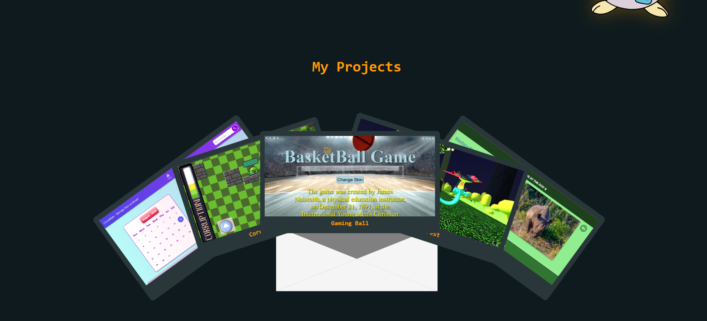
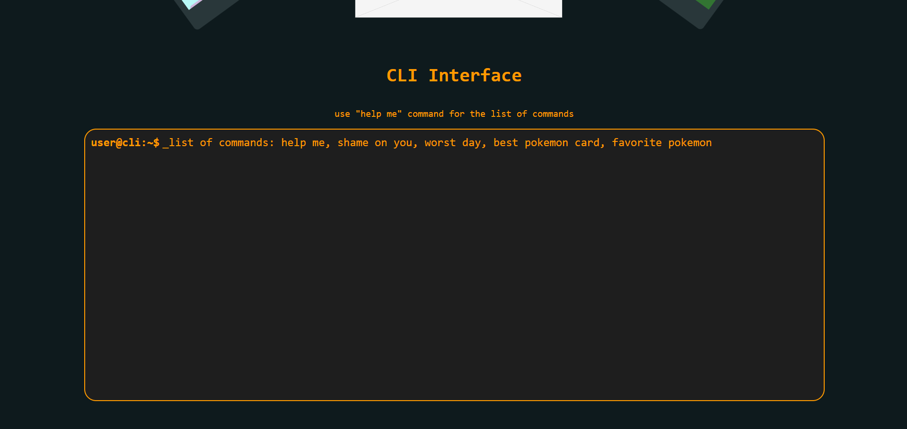

# CLIportfolio
A dark-themed portfolio website with a CLI interface at the end of the website

It conatins animations and different cli commands.

# About

## Header 
It is linked with the website and will let access different areas of the website. 

## Projects

Try clicking on the envelope and just see the magic 
(it look me hours to implement adn some AI debugging)

## Cli interface 
This is the cli interface you can type commands here and get output
(The inner input tag totally blew my mind I din't even know we could do that, Ai helped in this too)

You can just start by typing `help me` command to get a list of commands

The command names are already self-explaratory. Don't feel shy to try it out for yourself

# TechStack

The project is made entirely in React. 
Programming Languages used are HTML, CSS, JavaScript
Specific React Hooks used are useState and useEffect.I don't know other hooks🫡

# How to use website

Its so obvious duh!! just click the link in the github About section🤯

# Inspiration

I once did a ysws( I forgot the name sorry😭) that had a cli interface in its website, I found that really interesting and wanted to try making it myself because it looked really cool 
So that's how I ended up doing this project

