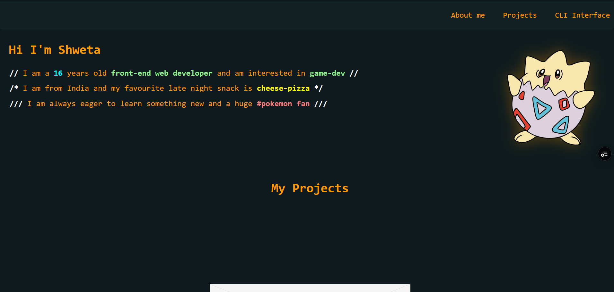

# CLIportfolio
A dark-themed portfolio website with a CLI interface at the end of the website

It conatins animations and different cli commands.

# Header 
It is linked with the website and will let access different areas of the website. 

## Projects

Try clicking on the envelope and just see the magic 
(it look me hours to implement adn some AI debugging)

## Cli interface 
This is the cli interface you can type commands here and get output
(The inner input tag totally blew my mind I din't even know we could do that, Ai helped in this too)

You can just start by typing `help me` command to get a list of commands

The command names are already self-explaratory

